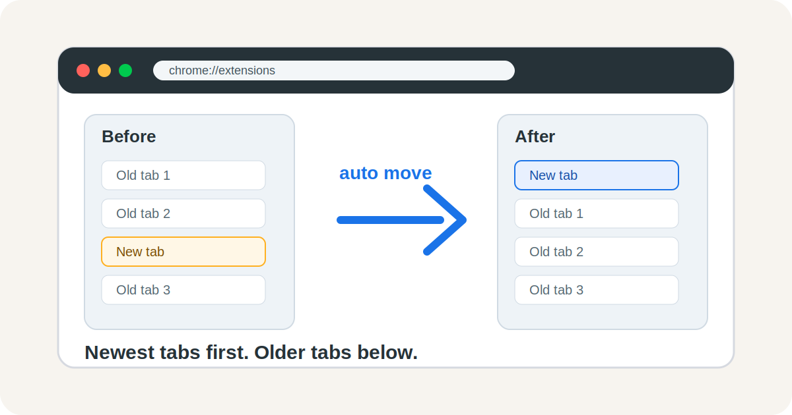

# Chrome Tab Top Order

English | [简体中文](README.zh-CN.md)



Chrome Tab Top Order is a tiny Chrome MV3 extension for keeping your newest browsing context visible: **newly opened tabs are automatically moved to the top of the current window's normal tabs, while older tabs move downward naturally.**

It is useful for vertical tab bars, sidebar-style tab lists, and workflows where the newest context should stay first.

## Problem Solved

- Newly opened tabs can be hard to spot when they are inserted near the current tab or at the end.
- With many open tabs, fresh pages can get buried between older pages.
- Manually dragging tabs into order is repetitive and interrupts focus.

## Features

- Moves newly opened normal tabs to the top of the current window.
- Keeps pinned tabs at the very front and leaves them untouched.
- Lets you click the extension icon to reverse the existing normal tab order once.
- No build step and no dependencies; load the folder directly in Chrome.

## Usage

1. Open Chrome and go to `chrome://extensions/`.
2. Enable `Developer mode`.
3. Click `Load unpacked`.
4. Select this project directory:

```text
/Users/bytedance/my_project/chrome_tab_top_order
```

After loading it, newly opened normal tabs will automatically move to the top.

To reverse the existing normal tabs in the current window once, click the `Chrome Tab Top Order` extension icon in the toolbar.

## Files

- `manifest.json`: Chrome MV3 extension manifest.
- `service_worker.js`: Listens for new tabs and moves them to the top.
- `assets/tab-order-preview.svg`: README preview image.
- `LICENSE`: MIT License.

## License

MIT
